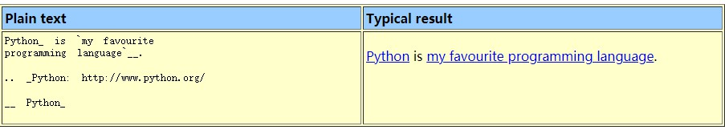

reStructuredText
================

Inline Markup
--------------

Escaping with Backslashes
----------------------------

Section Structure
------------------

Paragraphs
----------------

Bullet List
------------

Enumerated List
---------------

Definition List
---------------

Field List
-----------

Option List
-----------

Literal Blocks
--------------

Line Blocks
------------

Block Quotes
-------------

Doctest Blocks
---------------

Tables
----------

.. image:: _static/tables.jpg

Transitions
------------

Footnotes
---------------

Citations
----------

Hyperlink Targets
------------------

External Hyperlink Targets
~~~~~~~~~~~~~~~~~~~~~~~~~~~~~

Internal Hyperlink Targets
~~~~~~~~~~~~~~~~~~~~~~~~~~~~

Indirect Hyperlink Targets
~~~~~~~~~~~~~~~~~~~~~~~~~~~

Implicit Hyperlink Targets
~~~~~~~~~~~~~~~~~~~~~~~~~~~~~

Directives
-----------

Substitution References and Definitions
----------------------------------------

Comments
-----------

.. image:: _static/comments.jpg

